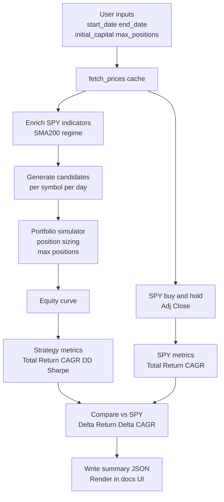

# Backtest scalability + methodology plan

## What exists today (quick audit)

### User inputs already exist (CLI)
The CLI runner already exposes user inputs:
- Capital and max positions via [`scripts/run_backtest.py:parse_args()`](scripts/run_backtest.py:72)
  - `--initial-capital` (default 10000)
  - `--max-positions` (default 5)
- Test period via [`scripts/run_backtest.py:parse_args()`](scripts/run_backtest.py:72)
  - `--start-date`, `--end-date`

So the main gap is **surfacing these inputs clearly in the JSON/UI** and aligning defaults with “10-year backtest”.

### What triggers buy/sell right now
Signals are generated per symbol in [`src/screener/backtest/engine.py:_generate_symbol_candidates()`](src/screener/backtest/engine.py:237)

**Common eligibility filters** (must pass):
- `signal_close > min_price`
- `volume >= min_volume`
- `avg_dollar_volume_20d >= min_avg_dollar_volume_20d`
- `market_cap > min_market_cap`
- `beta_1y > min_beta_1y`

**Regime filter (SPY)**
- Regime is computed from benchmark SPY enriched with SMA200 in [`src/screener/backtest/engine.py:_regime_state_series()`](src/screener/backtest/engine.py:52)
- If `SPY Close > SPY SMA200` → `bull` regime else `weak` regime.

**Bull engine signal**
- In bull regime, signal when (approx) breakout proximity:
  - `signal_close >= high_20d * 0.995`

**Weak engine signal**
- In weak regime, signal when oversold:
  - `signal_close <= bb_lower` AND `rsi14 <= weak_rsi_threshold` (default 30)

**Entry rule**
- Enter at **next session open** (`entry_i = i + 1`, `entry_price = Open[entry_i]`).

**Exit rule**
- Uses a precomputed stop-loss and take-profit derived from signal-date ATR/BB:
  - `tp_level = signal_close + 3 * ATR14`
  - `sl_level = bb_lower - ATR14`
- Exit occurs on the first date where Close hits TP or SL; otherwise exit at end-of-test (EOT).

Portfolio-level execution is more realistic (gap-aware) and happens in [`src/screener/backtest/portfolio.py:simulate_portfolio()`](src/screener/backtest/portfolio.py:161)
- Entry fill price includes slippage and commission
- Exit checks for gaps at open, then intraday High/Low, then planned exit date close
- Conservative rule: if TP and SL both touched same day → stop prioritized

### Definitions of overall return and CAGR (current)
In portfolio simulator metrics ([`src/screener/backtest/portfolio.py:simulate_portfolio()`](src/screener/backtest/portfolio.py:161)):
- **Overall return (total_return_pct)**
  - `((final_equity / initial_capital) - 1) * 100`
- **CAGR (cagr_pct)**
  - Computed from first/last dates in the equity curve and initial/final equity in [`src/screener/backtest/portfolio.py:_annualized_cagr()`](src/screener/backtest/portfolio.py:92)

What’s missing:
- Clear disclosure of these definitions in the UI
- SPY benchmark return/CAGR over the same period

### Data scalability / static-old-data + append after close
This is mostly already implemented in [`src/screener/data.py:fetch_prices()`](src/screener/data.py:224)

Key mechanics:
- Data is cached per symbol in CSV in `data/cache` ([`src/screener/config.py:Settings.cache_dir`](src/screener/config.py:8)).
- “Market-aware refresh”:
  - Determines the latest completed US session date (NY time) in [`src/screener/data.py:_current_market_session_date()`](src/screener/data.py:43)
  - If manifest latest_market_session_date != target_session → refresh is needed
- When refresh is needed, it **appends only missing tail bars** (incremental download) if cached max date < latest session.

So: yes, the logic exists to treat old history as static and only append after close.

What’s missing:
- Exposing this behavior in diagnostics/UI clearly (latest cache date, session date, how many symbols appended)
- Ensuring lookback is always at least 10 years + warmup

## Target improvements

### A) Add 10-year data policy (and handle newly listed stocks)
Policy:
- Default backtest range should be last 10 calendar years (or fixed 10-year window) unless user overrides.
- For stocks not listed 10 years ago: we still include them if they have enough bars for indicators and warmup.

Implementation direction:
- Use `--start-date/--end-date` as source of truth.
- Add a convenience CLI option `--years 10` (optional) that sets start/end automatically, while still allowing explicit start/end.
- Tighten “insufficient history” reason:
  - currently skips when `len(enriched) <= warmup_bars` ([`src/screener/backtest/engine.py:471`](src/screener/backtest/engine.py:471))
  - keep this, but add more diagnostics: list earliest available date and required warmup start.

### B) Benchmark comparison: SPY buy-and-hold total return + CAGR
Goal:
- Report strategy metrics vs SPY over same test window.

Definition:
- SPY total return %: `((spy_end / spy_start) - 1) * 100`
- SPY CAGR %: `((spy_end / spy_start) ** (1/years) - 1) * 100` using same day count / 365.25 as portfolio.

Data basis:
- Use SPY **Adj Close** for buy-and-hold benchmark (dividends-adjusted proxy).
- Use first available date on/after start_date and last available date on/before end_date.

Output:
- Add `benchmark` block under backtest summary JSON:
  - `spy_total_return_pct`, `spy_cagr_pct`
  - `strategy_minus_spy_total_return_pct`, `strategy_minus_spy_cagr_pct`
  - `spy_start_date_used`, `spy_end_date_used`, `spy_start_px`, `spy_end_px`

### C) Surface methodology and definitions to users
The UI already renders a Methodology section and Run Information in Backtesting tab via:
- [`docs/app.js:renderBacktestRunMeta()`](docs/app.js:1246)
- [`docs/app.js:renderBacktestMethodology()`](docs/app.js:1275)

Plan:
- Extend summary JSON to include:
  - plain-English definitions for overall return & CAGR
  - explicit buy/sell triggers in a structured way
  - portfolio sizing rules (equal-weight cap, risk cap) and rejection logic
- Update UI to display the new benchmark comparison and definitions.

### D) Scalability (compute) recommendations (non-invasive)
Current bottlenecks:
- Enriching indicators for every symbol each run can be expensive.
- Portfolio sim already uses candidate generation to avoid skip-forward.

Incremental improvements:
1) Keep cached OHLCV static and only append new bars (already done).
2) Consider caching *indicator-enriched* frames per symbol to disk (optional next step).
   - Only recompute last N bars after append.
   - This is a larger change; propose as Phase 2.

## Proposed implementation phases

### Phase 1 (clarity + metrics + 10Y defaults)
- Add 10-year default window (CLI convenience or new defaults)
- Add SPY buy-and-hold benchmark metrics and deltas
- Expand JSON payload with methodology + definitions
- Update Backtesting UI cards to show benchmark and deltas

### Phase 2 (performance)
- Optional: indicator cache / incremental indicator computation
- Optional: parallelization per symbol where safe

## Mermaid: backtest data + metrics flow

