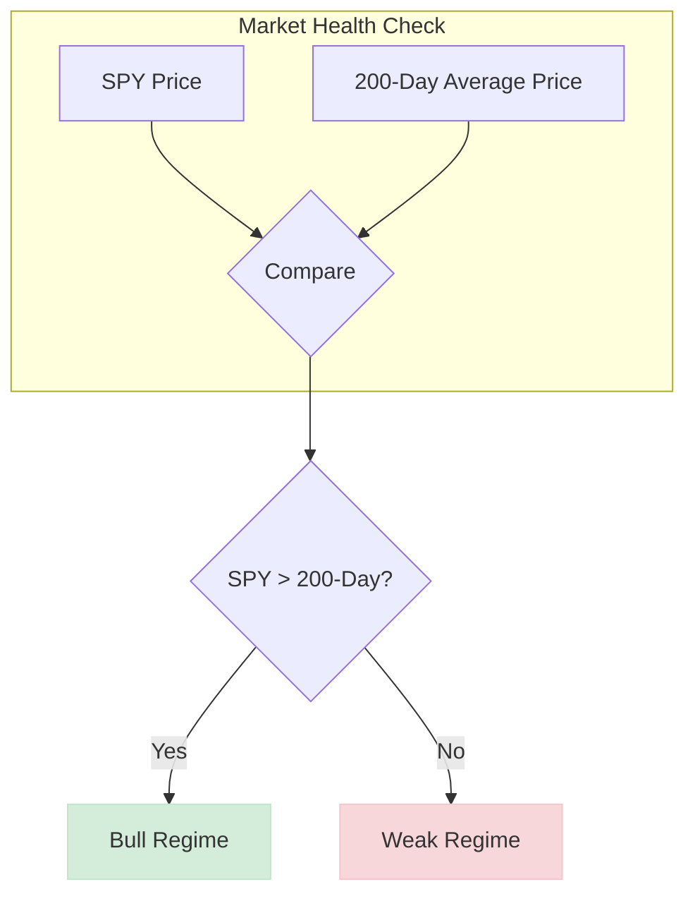
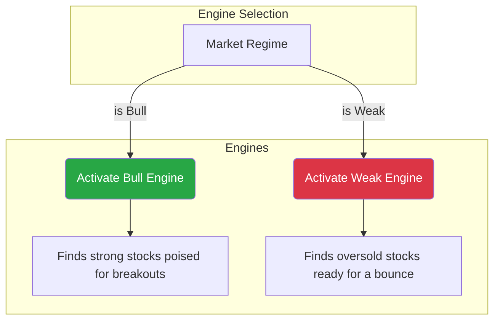
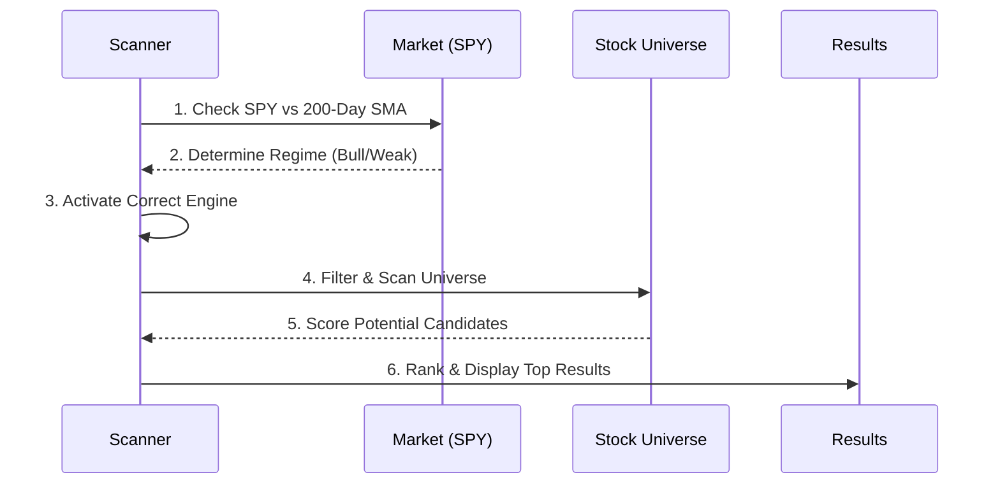

# "How It Works" Tab Design

This document outlines the design for the new "How It Works" tab, which replaces the old "Background" tab. The design is based on the logic defined in `plans/scanner_logic_summary.md`.

## Tab Structure and UI Layout

The tab will be renamed to **"How It Works"**. It will be structured into the following sections, presented in a clean, single-column layout with cards and diagrams.

---

### A. Top Summary / Hero Section

A prominent hero section at the top of the page that immediately informs the user about the current state of the scanner.

**UI Component:** A banner or a large card.

**Content:**
*   **Headline:** "The Market is Currently in a **[Regime]** Regime."
*   **Sub-headline:** "The **[Engine Name]** Engine is active. Here’s what that means."
*   **Dynamic Content:** The `[Regime]` and `[Engine Name]` will be dynamically populated based on the `market_condition.json` data. For example, "Bull Regime" and "Bull Engine".

---

### B. Regime Explanation Section

This section explains how the market regime is determined, using a simple visual metaphor.

**UI Component:** A container with a clear heading and a simple diagram.

**Content:**
*   **Headline:** "How We Classify the Market"
*   **Explanation:** "The scanner's first job is to determine the overall market health. We do this by looking at the S&P 500 (SPY) and its long-term trend (the 200-day moving average)."
*   **Visual:**

---

### C. Engine Activation Flow

A clear flow diagram showing the direct relationship between the market regime and the selected scanning engine.

**UI Component:** A container with a heading and a Mermaid diagram.

**Content:**
*   **Headline:** "One Regime, One Engine"
*   **Explanation:** "Based on the market regime, the scanner activates the appropriate engine. Each engine is specifically designed to find opportunities in that environment."
*   **Visual:**

---

### D. Engine/Strategy Cards

A modular, reusable card component for each engine. This design allows for easy addition of new engines in the future without a redesign.

**UI Component:** A responsive grid or flexbox container holding multiple "Card" components.

**Content (per card):**

*   **Card 1: Bull Engine**
    *   **Title:** Bull Engine
    *   **Tagline:** Finding Breakout Leaders
    *   **Purpose:** This engine looks for stocks in strong uptrends that are consolidating and getting ready for their next major price move.
    *   **What it looks for:**
        *   **Strong Uptrend:** Stock is already outperforming the market.
        *   **Price Consolidation:** Looks for classic patterns like "Cup with Handle" or "Volatility Contraction".
        *   **Breakout Readiness:** Scores stocks on how close they are to a key pivot price with high volume.

*   **Card 2: Weak Engine**
    *   **Title:** Weak Engine
    *   **Tagline:** Spotting Potential Rebounds
    *   **Purpose:** This engine looks for fundamentally sound stocks that have been sold off too aggressively and are due for a short-term bounce.
    *   **What it looks for:**
        *   **Oversold Condition:** Stock's RSI (a momentum indicator) is below 30.
        *   **Price Extension:** Stock is trading far below its recent price range (Lower Bollinger Band).
        *   **Seller Exhaustion:** Looks for a spike in volume, suggesting the selling pressure is fading.

---

### E. Scanner Workflow Section

A high-level, step-by-step diagram illustrating the entire process from start to finish.

**UI Component:** A container with a heading and a simple, numbered visual flow.

**Content:**
*   **Headline:** "The Full Scanner Workflow"
*   **Visual:**

---

### F. How to Read the Results Section

A final, concise section explaining what a user should take away from a scanner result.

**UI Component:** A simple text block with a clear heading.

**Content:**
*   **Headline:** "What Does a Result Mean?"
*   **Explanation:** "A result from the scanner is **not** a buy signal. It is a high-potential, filtered idea that deserves your immediate attention. Each result has passed a rigorous, data-driven check based on the active engine's strategy. Your next step is to conduct your own due diligence on the candidates that interest you."

