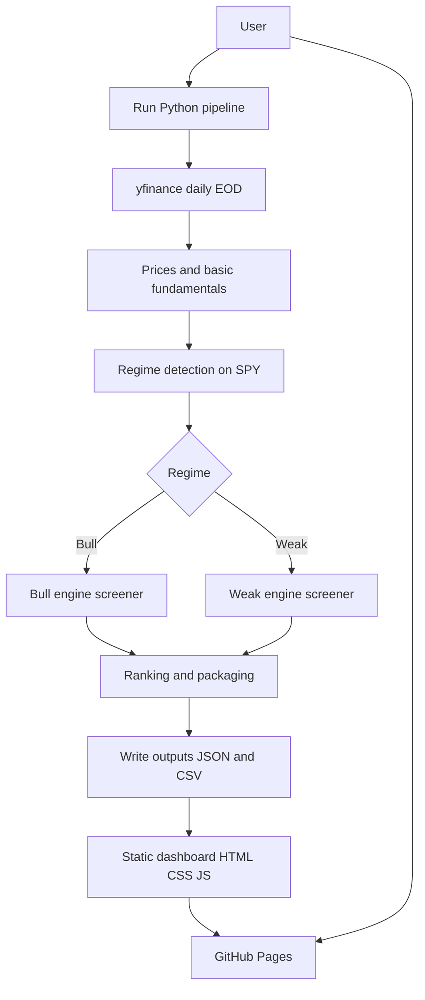
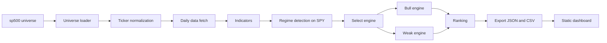

# US Market Regime Dual-Engine Stock Screener — V1 Spec

## Summary
This project produces a static, GitHub Pages-hosted stock screening dashboard for U.S. equities. A Python pipeline determines the current market regime using a benchmark (SPY) and a simple regime rule (price vs 200-day SMA). Based on the regime, it runs one of two screening engines (bull vs weak) to rank candidate stocks for manual research.

V1 is screening and research only. No broker integration, order routing, or automated execution.

## Goals
- Generate daily end-of-day screening outputs for a defined U.S. equity universe.
- Detect market regime using SPY and a 200-day simple moving average rule.
- Run a dual-engine screener that adapts candidate selection and ranking to regime.
- Publish outputs as static data files consumable by a lightweight frontend.
- Deliver a static dashboard (HTML/CSS/JS) that loads the latest results and displays:
  - regime state
  - active engine
  - ranked candidates
  - indicator context
  - basic fundamentals where available

## Non-goals (V1)
- Trade execution, alerts, broker APIs, order management, or portfolio optimization.
- Intraday scanning; V1 uses daily EOD data only.
- A backend service or database requirement; V1 is file-based.
- Guaranteeing full fundamental coverage; missing data must be handled gracefully.

## Defaults to Encode (Explicit V1 Decisions)
- Universe: tickers from [`sp500.txt`](sp500.txt:1). Treat as V1 universe; allow swapping later.
- Regime benchmark: SPY.
- Regime rule: SPY close vs 200-day SMA.
  - Bull regime if close > SMA200
  - Weak regime otherwise
- Data source: daily EOD via yfinance.
- Outputs: generate both JSON (primary) and CSV (secondary) for the frontend.
- Cadence: local manual run and automated GitHub Actions regeneration.
  - Workflow: [`.github/workflows/daily_screener.yml`](.github/workflows/daily_screener.yml:1)
  - Publish artifacts: [`docs/data/latest.json`](docs/data/latest.json:1) and [`docs/data/latest.csv`](docs/data/latest.csv:1)
- V1 is screening and research only, no execution.

## User Flow and System Flow
### User flow
1. User runs the local Python pipeline.
2. Pipeline fetches or refreshes daily EOD data.
3. Pipeline computes indicators, detects regime, runs the relevant engine, ranks candidates.
4. Pipeline writes versioned and latest outputs as JSON and CSV.
5. User opens the static dashboard (locally or via GitHub Pages) to review candidates.

### System flow
- Inputs: universe file, configuration, market data.
- Processing: normalize tickers, fetch data, compute indicators, detect regime, screen, rank.
- Outputs: JSON and CSV files; static frontend reads JSON primarily.

## Architecture Overview
### High-level architecture
- Batch pipeline: Python scripts run on demand and generate static artifacts.
- Storage: generated artifacts are committed or published for GitHub Pages consumption.
- Frontend: static HTML/CSS/JS reads JSON outputs via fetch and renders tables and detail panels.

### Data model orientation
- Output files are the contract between pipeline and UI.
- JSON is primary for the UI because it supports nested structures, metadata, and richer fields.
- CSV is secondary for quick inspection, spreadsheet import, and interoperability.

### Key design constraints
- Universe must represent U.S.-listed common stocks only.
- Exclusions: OTC, preferreds, warrants, rights, ETFs, ETNs, options, futures, crypto, derivatives.
- Must remain modular so data source, ranking logic, and UI can evolve independently.

## Chosen Stack and Rationale
### Python pipeline
- Python is used for:
  - data collection via yfinance
  - indicator and regime computation
  - screening logic and ranking
  - exporting JSON and CSV
- Rationale:
  - strong ecosystem for data processing
  - easy iteration on quant screening logic
  - produces static artifacts for a no-backend deployment

### Static frontend on GitHub Pages
- Plain HTML/CSS/JS in V1.
- Rationale:
  - minimal build complexity
  - easy hosting with GitHub Pages
  - fast load times for static content
  - keeps V1 focused on signal generation and presentation

## Main Modules and Responsibilities
Proposed modules are conceptual; file paths may vary with final repository layout.

- Universe
  - Load universe tickers from [`sp500.txt`](sp500.txt:1).
  - Normalize tickers for yfinance compatibility.
    - Example: BRK.B and BF.B may require mapping to BRK-B and BF-B for yfinance.
  - Validate and filter to U.S.-listed common stock intent.

- Configuration
  - Centralize defaults and thresholds.
  - Include scan parameters like:
    - SMA lengths
    - breakout lookback
    - RSI thresholds
    - Bollinger Band settings
    - min price and liquidity constraints

- Data acquisition
  - Fetch daily EOD OHLCV for SPY and universe tickers.
  - Optional caching to avoid repeated downloads.

- Indicators
  - Compute common indicators used by engines and ranking:
    - SMA
    - RSI
    - Bollinger Bands
    - rolling highs and lows
    - simple relative strength metrics versus SPY

- Regime detection
  - Compute SMA200 for SPY.
  - Determine regime based on SPY close vs SMA200.
  - Persist regime metadata to outputs.

- Screening engines
  - Bull engine
    - Trend and momentum oriented candidate selection.
    - Example signals: new 20-day highs, breakouts, strong relative strength.
  - Weak engine
    - Oversold rebound oriented candidate selection.
    - Example signals: RSI below threshold, price below lower Bollinger Band, optional reversal confirmation.

- Ranking
  - Combine signal strength, liquidity, relative strength, and basic fundamental quality.
  - Output a final rank score and component metrics for explainability.

- Exporters
  - Write JSON and CSV outputs.
  - Keep stable schema for the frontend.
  - Output both a latest file and versioned snapshots.

- Frontend UI
  - Load JSON output.
  - Render:
    - regime banner
    - engine name
    - candidates table sorted by rank
    - expandable detail view per ticker

## Data Flow

## Outputs and File Contracts
### JSON primary output
Recommended top-level keys:
- meta
  - generated_at
  - universe_name and universe_version
  - data_source
  - benchmark
  - regime
  - config hash or config snapshot
- candidates
  - array of objects with:
    - ticker
    - rank
    - score breakdown
    - key indicators
    - liquidity metrics
    - optional fundamentals
- diagnostics
  - missing data counts
  - skipped tickers and reasons

### CSV secondary outputs
- candidates.csv with one row per ticker candidate, flattened fields.
- optional diagnostics.csv listing skipped symbols and reasons.

## Risks and Assumptions
- yfinance data reliability and occasional missing fields.
- Ticker normalization edge cases, especially class shares with dot notation.
- Fundamentals coverage is incomplete and may vary across symbols.
- GitHub Pages hosting requires outputs to be placed in a published folder and paths must be consistent.
- Performance considerations: fetching full histories for many tickers can be slow.
  - Mitigation: limited lookback windows and caching.

## Implementation Phases
1. Planning docs and repo conventions
   - Produce planning docs and define output contract.
2. Project scaffold and configuration
   - Establish directories and config defaults.
   - Universe loader with ticker normalization.
3. Data acquisition layer
   - yfinance fetch for SPY and tickers.
   - caching and retry logic.
4. Indicators and regime
   - SMA200 regime detection.
   - indicator computation utilities.
5. Screening engines
   - bull engine rules
   - weak engine rules
6. Ranking and exports
   - scoring model
   - JSON schema and CSV exports
7. Static frontend dashboard
   - read JSON
   - render summary and ranked table
8. QA and documentation
   - validate outputs
   - update documentation and ensure reproducible run steps
9. Optional later
   - expanded universe and metadata management
   - enhanced UI or React TypeScript if complexity grows
