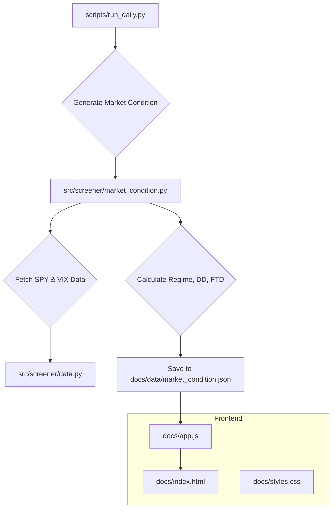

# Specification: Market Condition Tab

## 0. Addendum (2026-04-18): Normalized dual-engine scoring refactor

### Summary
- Bull and weak engines were refactored from hard RS/pattern gates to a robust cross-sectional normalized scoring model.
- Production ranking now uses a single normalized `score` field.
- Legacy engine score logic is retained only under `debug_metrics.legacy_score` for comparison.
- Added `setup_tag` output labels: `Both`, `Actionable Breakout`, `Leadership`, `Watchlist`.

### Hard filters (kept)
- `min_price`
- `min_market_cap`
- `min_beta_1y`
- `min_volume`
- `min_avg_dollar_volume_20d` (new)

### Shared normalization layer
Implemented in `src/screener/engines/scoring.py`:
- `to_float(value)`
- `clamp01(value)`
- `sigmoid(value)`
- `robust_unit_score(value, population, invert=False, neutral=0.5)`

Normalization behavior:
- Uses median + MAD for robust z-scoring.
- Squashes to `[0,1]` via sigmoid.
- Returns neutral score (`0.5`) when feature value is missing or population is too small.
- Supports `invert=True` for lower-is-better factors.

### Bull engine v2 model
- Leadership axis:
  - `rs_component` (RS strength/trend)
  - `trend_component` (distance vs SMA200)
  - `leadership_score = 0.6*rs + 0.4*trend`
- Actionability axis:
  - `breakout_component`
  - `compression_component` (inverted ATR10/ATR50)
  - `volume_component`
  - `stage_component`
  - `actionability_score = 0.4*breakout + 0.25*compression + 0.2*volume + 0.15*stage`
- Final score:
  - `score = 100 * (0.55*actionability + 0.45*leadership)`

### Weak engine v2 model
- Actionability axis:
  - `reversal_component`
  - `extension_component`
  - `capitulation_component`
  - `actionability_score = 0.45*reversal + 0.35*extension + 0.20*capitulation`
- Leadership axis:
  - `trend_component`
  - `liquidity_component`
  - `leadership_score = 0.70*trend + 0.30*liquidity`
- Final score:
  - `score = 100 * (0.60*actionability + 0.40*leadership)`

### Runtime/export/backtest alignment
- Daily runtime passes `min_avg_dollar_volume_20d` into both engines.
- Exported scanner settings include `min_avg_dollar_volume_20d`.
- Backtest common eligibility now enforces `avg_dollar_volume_20d >= min_avg_dollar_volume_20d`.

### Validation
- Added unit tests for robust normalization edge cases under `tests/test_scoring.py`.
- Smoke backtest completed successfully using test universe via `scripts/run_backtest.py`.

---

## 1. Architecture Overview

This document outlines the plan to add a new "Market Condition" tab to the application. The new feature will introduce a dedicated backend module for market analysis and a corresponding frontend component for visualization.

The overall architecture will be updated as follows:

1.  **Backend**: A new module, `src/screener/market_condition.py`, will be created to encapsulate all logic for calculating the market regime, distribution days (DD), and follow-through days (FTD).
2.  **Daily Script**: The existing `scripts/run_daily.py` will be modified to import and execute the new market condition script.
3.  **Data Output**: The result will be saved as a new JSON file: `docs/data/market_condition.json`.
4.  **Frontend**: The `docs/app.js` will fetch this new data file. A new tab will be added to `docs/index.html`, and `app.js` will render the indicators and a new SPY chart in this tab.
5.  **Charting**: The project currently uses `Chart.js`. For consistency, the new SPY chart will also be implemented using `Chart.js`, not `lightweight-charts`.

### Mermaid Diagram: System Flow



## 2. Data Structure

The `docs/data/market_condition.json` file will have the following structure:

```json
{
  "generated_at": "YYYY-MM-DDTHH:MM:SSZ",
  "regime": "Bull",
  "spy_close": 450.75,
  "vix_close": 15.2,
  "distribution_day_count": 3,
  "ftd_count": 1,
  "chart_data": {
    "dates": ["2023-01-01", "..."],
    "spy_close": [440.1, "..."],
    "sma50": [430.5, "..."],
    "sma200": [400.2, "..."],
    "distribution_days": [
        { "date": "2023-10-26", "price": 413.72 },
    ],
    "follow_through_days": [
        { "date": "2023-11-02", "price": 431.75 },
    ]
  }
}
```

## 3. Backend Implementation

### 3.1. New File: `src/screener/market_condition.py`

This file will contain the logic for market analysis.

```python
# src/screener/market_condition.py

import pandas as pd
from src.screener import data

def calculate_regime(spy_df: pd.DataFrame) -> str:
    """
    Calculates the market regime based on three signals.
    - Signal 1: SPY close > 200-day SMA.
    - Signal 2: SPY close > 50-day SMA.
    - Signal 3: 50-day SMA 5-day direction > +0.1%.
    """
    # ... implementation ...
    return "Bull" # or "Bear", "Choppy"

def calculate_distribution_days(spy_df: pd.DataFrame) -> (int, list):
    """
    Identifies and counts distribution days over a rolling 25-day window.
    - SPY close down >= 0.2%.
    - Volume > prior day's volume.
    """
    # ... implementation ...
    return (3, [{"date": "...", "price": ...}])

def calculate_follow_through_days(spy_df: pd.DataFrame) -> (int, list):
    """
    Identifies and counts Follow-Through Days (FTD).
    - Occurs on day 4 or later of a rally attempt.
    - SPY gain >= 1.25%.
    - Volume > prior day's volume.
    """
    # ... implementation ...
    return (1, [{"date": "...", "price": ...}])

def generate_market_condition_data() -> dict:
    """
    Main function to generate the complete market condition data package.
    """
    spy_df = data.get_history('SPY', days=300)
    vix_df = data.get_history('^VIX', days=5)

    # Calculate indicators
    regime = calculate_regime(spy_df)
    dd_count, dd_markers = calculate_distribution_days(spy_df)
    ftd_count, ftd_markers = calculate_follow_through_days(spy_df)

    # Prepare data structure
    market_condition = {
        "generated_at": pd.Timestamp.utcnow().isoformat(),
        "regime": regime,
        "spy_close": spy_df['Close'].iloc[-1],
        "vix_close": vix_df['Close'].iloc[-1],
        "distribution_day_count": dd_count,
        "ftd_count": ftd_count,
        "chart_data": {
            "dates": spy_df.index.strftime('%Y-%m-%d').tolist(),
            "spy_close": spy_df['Close'].tolist(),
            "sma50": spy_df['SMA50'].tolist(),
            "sma200": spy_df['SMA200'].tolist(),
            "distribution_days": dd_markers,
            "follow_through_days": ftd_markers,
        }
    }
    return market_condition

```

### 3.2. Modifications to `scripts/run_daily.py`

The daily script will be updated to run the new market condition analysis.

```python
# scripts/run_daily.py

# ... existing imports ...
from src.screener import market_condition # New import
import json

def save_json(data: dict, path: str):
    """Utility to save dict to JSON."""
    with open(path, 'w') as f:
        json.dump(data, f, indent=2)

def main():
    # ... existing logic to run screener and save latest.json ...

    # --- New Section ---
    print("Running market condition analysis...")
    market_data = market_condition.generate_market_condition_data()
    save_json(market_data, 'docs/data/market_condition.json')
    print("Market condition data saved.")
    # --- End New Section ---

if __name__ == "__main__":
    main()
```

## 4. Frontend Implementation

### 4.1. `docs/index.html` Changes

-   Add a new tab button and tab panel.

```html
<!-- In nav.tabs -->
<button id="tabBtnMarketCondition" class="tab-btn" data-tab="marketCondition" type="button">Market Condition</button>
<button id="tabBtnScreener" class="tab-btn active" data-tab="screener" type="button">Screener Result</button>
<button id="tabBtnBackground" class="tab-btn" data-tab="background" type="button">Background</button>
<button id="tabBtnHistory" class="tab-btn" data-tab="history" type="button">Backtesting</button>

<!-- After </section> for tabScreener -->
<section id="tabMarketCondition" class="tab-panel" aria-labelledby="tabBtnMarketCondition">
    <section class="summary-grid">
        <div class="card">
            <h3>Regime</h3>
            <p id="mcRegime">-</p>
        </div>
        <div class="card">
            <h3>SPY Close</h3>
            <p id="mcSpyClose">-</p>
        </div>
        <div class="card">
            <h3>VIX Close</h3>
            <p id="mcVixClose">-</p>
        </div>
        <div class="card">
            <h3>Distribution Days</h3>
            <p id="mcDdCount">-</p>
        </div>
        <div class="card">
            <h3>Follow-Through Days</h3>
            <p id="mcFtdCount">-</p>
        </div>
    </section>
    <section class="card">
        <h2>SPY Chart (1Y)</h2>
        <canvas id="marketConditionChart" height="120"></canvas>
    </section>
</section>
```

### 4.2. `docs/app.js` Changes

-   Fetch `market_condition.json`.
-   Render the indicators and the new chart.

```javascript
// In state object
let state = {
    // ... existing state
    marketCondition: {
        loaded: false,
        loading: false,
        data: null,
        error: null,
    },
    marketConditionChart: null,
};

// New function to load market condition data
async function loadMarketConditionData() {
    if (state.marketCondition.loaded || state.marketCondition.loading) return;
    state.marketCondition.loading = true;
    
    try {
        const res = await fetch(`data/market_condition.json?t=${Date.now()}`);
        if (!res.ok) throw new Error(`HTTP ${res.status}`);
        const data = await res.json();
        state.marketCondition.data = data;
        state.marketCondition.loaded = true;
        renderMarketCondition(data);
    } catch (err) {
        state.marketCondition.error = err.message;
        // Handle error display
    } finally {
        state.marketCondition.loading = false;
    }
}

// New function to render the data
function renderMarketCondition(data) {
    document.getElementById('mcRegime').textContent = data.regime;
    document.getElementById('mcSpyClose').textContent = fmtNumber(data.spy_close);
    document.getElementById('mcVixClose').textContent = fmtNumber(data.vix_close);
    document.getElementById('mcDdCount').textContent = fmtInt(data.distribution_day_count);
    document.getElementById('mcFtdCount').textContent = fmtInt(data.ftd_count);

    renderMarketConditionChart(data.chart_data);
}

// New function to render the chart
function renderMarketConditionChart(chartData) {
    const ctx = document.getElementById('marketConditionChart');
    destroyChart(state.marketConditionChart);

    // Scatter data for markers
    const ddPoints = chartData.distribution_days.map(d => ({ x: d.date, y: d.price }));
    const ftdPoints = chartData.follow_through_days.map(d => ({ x: d.date, y: d.price }));

    state.marketConditionChart = new Chart(ctx, {
        type: 'line',
        data: {
            labels: chartData.dates,
            datasets: [
                { label: 'SPY Close', data: chartData.spy_close, borderColor: '#3b82f6', borderWidth: 2, pointRadius: 0 },
                { label: 'SMA50', data: chartData.sma50, borderColor: '#22c55e', borderWidth: 1.5, borderDash: [4, 4], pointRadius: 0 },
                { label: 'SMA200', data: chartData.sma200, borderColor: '#e879f9', borderWidth: 1.5, borderDash: [2, 4], pointRadius: 0 },
                {
                    type: 'scatter',
                    label: 'Distribution Day',
                    data: ddPoints,
                    backgroundColor: 'red',
                    pointStyle: 'triangle',
                    rotation: 180,
                    radius: 6,
                },
                {
                    type: 'scatter',
                    label: 'Follow-Through Day',
                    data: ftdPoints,
                    backgroundColor: 'lime',
                    pointStyle: 'triangle',
                    radius: 6,
                }
            ]
        },
        options: { /* ... standard chart options ... */ }
    });
}

// In boot() function
async function boot() {
    // ...
    loadMarketConditionData(); // Load the new data on boot
    // ...
}

// In activateTab() function
function activateTab(buttons, panels, key) {
    // ...
    if (key === 'marketCondition') {
        loadMarketConditionData();
    }
    // ...
}
```

### 4.3. `docs/styles.css` Changes

-   Add basic styling for the new components.

```css
/* In docs/styles.css */

#tabMarketCondition .summary-grid {
    grid-template-columns: repeat(auto-fit, minmax(150px, 1fr));
}
```

This plan provides a comprehensive overview of the required changes to implement the "Market Condition" tab.

## 5. Screener Result Tab

This section outlines the design for the updated screener result tab, which will incorporate a dual-view layout to enhance data visualization and analysis.

### 5.1. View Layouts

The screener result tab will feature two distinct layouts:

1.  **List View (Default):** A detailed, scrollable list of stocks matching the screener criteria. Each row will display comprehensive data for a single stock. This remains the default view.
2.  **Chart View:** A compressed list showing only the stock symbol on the left. The right-hand side will be dominated by a large candle chart displaying the historical price data for the selected symbol.

### 5.2. UI Components

-   **View Switcher:** A set of buttons will be added to the top of the screener result tab to allow users to toggle between "List View" and "Chart View".
-   **Chart Container:** A dedicated container will house the candle chart in the "Chart View".

### 5.3. Candle Chart

The candle chart will be a key feature of the "Chart View" and will reuse the existing TradingView-style implementation from the market condition tab to ensure consistency. It will display the main candlestick series and any selected moving averages as overlays. It will not include a separate line chart for "Adj Close".

-   **Data:** The chart will be populated with 3 years of daily candle data for the selected stock.
-   **Details Panel:** Above the chart, a panel will display key details for the selected symbol: Current Price, Stop Loss, Take Profit, ATR14, ROE, P/E, Revenue Growth QoQ, Revenue Growth YoY, Engine, and Score.
-   **Indicator Controls:** A set of checkboxes will be available to toggle various technical indicators on the chart: SMA20, SMA50, SMA200, EMA9, EMA21, and Volume. The candlestick series is always visible and not toggleable.
-   **Chart Legend:** Positioned below the indicator controls and above the chart, this component displays the name and color of each active, toggleable indicator (e.g., SMAs, EMAs). It will not include entries for the primary candlestick series or the volume bars.

### 5.4. Mermaid Diagram: Chart View Layout

The following diagram illustrates the layout of the "Chart View":

```mermaid
graph TD
    subgraph Screener Result Tab
        direction LR
        
        subgraph Viewport
            direction TB

            A[View Switcher: [List View] / [Chart View]]
            
            subgraph Chart View Layout
                direction LR
                B[Stock List]
                C[Chart Area]
            end
            
            A --> Chart View Layout
        end
    end

    subgraph B [Stock List]
        direction TB
        B1[Symbol 1]
        B2[Symbol 2]
        B3[Symbol 3]
    end

    subgraph C [Chart Area]
        direction TB
        C1[Details Panel]
        C2[Indicator Controls]
        C2_5[Chart Legend]
        subgraph Chart Panes
            direction TB
            C3[Main Chart (Candles + Overlays)]
            C4[Volume Pane]
        end
    end
```
